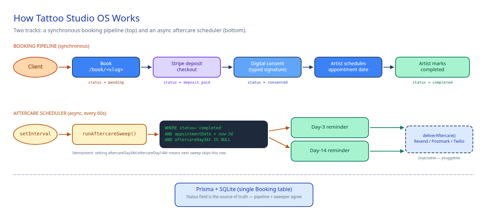

# How Tattoo Studio OS Works



Two tracks operate in parallel against a single `Booking` table:

1. **A synchronous booking pipeline** — driven by the client's actions and the artist's clicks.
2. **An async aftercare scheduler** — a 60-second sweeper that fires reminders without blocking anyone.

The **status field** (`pending` → `deposit_paid` → `consented` → `completed`) is the source of truth that both tracks agree on.

---

## Track 1 — Booking pipeline (synchronous)

### Step 1 · Book

The artist shares `https://your-domain.com/book/<your-slug>` (Instagram bio, business cards, anywhere). A client lands on the public page, fills out:

- name, email, phone
- description of the tattoo idea
- preferred date
- estimated session length

On submit, a `Booking` row is created with `status = pending` and the deposit amount snapshotted from the artist's settings (`User.depositCents`).

### Step 2 · Stripe deposit

The client is immediately redirected to a Stripe Checkout session in `payment` mode for the deposit amount. When `STRIPE_SECRET_KEY` is unset (demo mode), the system fakes a successful payment so the rest of the flow stays testable end-to-end.

After payment, status flips to `deposit_paid` and the client is redirected to the consent form.

### Step 3 · Digital consent

The consent form lists the standard tattoo-shop liability points (age, sobriety, allergies, aftercare responsibility) and asks the client to type their full legal name to sign. On submit:

- `status = consented`
- `consentSignedAt = now()`
- `consentName = <typed name>`

The signature is just text — for legal weight, you'd add an audit log and IP capture, but that's intentionally out of scope for the MVP.

### Step 4 · Artist schedules

The artist sees the booking in `/dashboard`, opens it, and picks an `appointmentDate` via a `datetime-local` input. This unlocks the aftercare countdown — the sweeper uses `appointmentDate` as the reference point for "day 3" and "day 14".

### Step 5 · Mark completed

After the session, the artist clicks **Mark completed**. This sets `status = completed` and (if not already set) backfills `appointmentDate` to "now" so the aftercare timer starts.

**Key files**
- `src/server.ts` → all routes under `/book/...` and `/bookings/...`
- `src/billing.ts` → `createDepositCheckout()` (handles demo mode)
- `prisma/schema.prisma` — `Booking` with status and timestamp columns

---

## Track 2 — Aftercare scheduler (async)

A `setInterval` runs every 60 seconds at boot. Each tick calls `runAftercareSweep()`:

```sql
-- Day 3 sweep
WHERE status IN ('completed', 'consented')
  AND appointmentDate < now() - 3 days
  AND aftercareDay3At IS NULL

-- Day 14 sweep (separate query)
WHERE status IN ('completed', 'consented')
  AND appointmentDate < now() - 14 days
  AND aftercareDay14At IS NULL
```

For each row found, the sweeper:

1. Calls `deliverAftercare()` (the injection point — defaults to `console.log`)
2. Sets `aftercareDay3At` (or `Day14At`) to **now**

Setting the timestamp is what makes the sweep **idempotent**. The next pass won't pick up the same booking again because the column is no longer `NULL`.

### Wiring real notifications

`deliverAftercare` is a module-level variable, not a hardcoded function. Override it once at boot:

```ts
import { setAftercareDelivery } from './aftercare.ts';
import { Resend } from 'resend';

const resend = new Resend(process.env.RESEND_API_KEY!);
setAftercareDelivery(async (msg) => {
  await resend.emails.send({
    from: 'studio@your-domain.com',
    to: msg.clientEmail,
    subject: msg.stage === 'day3' ? 'Aftercare check-in: day 3' : 'How is your tattoo healing?',
    text: `Hey ${msg.clientName}, ...`,
  });
});
```

You can swap Resend for Postmark, SendGrid, Twilio (SMS), or anything else with the same one-line change. The sweep tests in `tests/aftercare.test.ts` use this same injection point to assert delivery without sending real emails.

**Key files**
- `src/aftercare.ts` — sweeper, scheduler, injection point
- `tests/aftercare.test.ts` — exercises the full sweep against an isolated SQLite

---

## Underlying database

Everything is one table: `Booking`. The status column is a string enum (`pending` / `deposit_paid` / `consented` / `completed` / `cancelled`). Both tracks read and write the same row — no event bus, no queue, no microservice. SQLite handles the concurrency fine because the sweep is small and quick.

To migrate to Postgres, change `provider` in `prisma/schema.prisma` and update `DATABASE_URL`. No application code changes needed.

---

## Customization points

| You want to... | Touch this |
|---|---|
| Change the deposit amount | `/settings` page (per artist) or `DEFAULT_DEPOSIT_CENTS` in `.env` (default for new signups) |
| Add SMS reminders instead of email | `setAftercareDelivery()` — call Twilio inside |
| Customize the consent form text | `app.get('/book/:slug/consent/:id')` — the HTML is inline |
| Add a "reschedule" link for clients | Add `app.get('/book/:slug/reschedule/:id')` and a token check |
| Run sweeps less often (e.g. hourly) | `startAftercareScheduler(60 * 60 * 1000)` in `src/server.ts` |
| Add a 30-day "first-month check-in" | Copy the day-14 block in `runAftercareSweep()`, add a `aftercareDay30At` column |

---

## Source diagram

The diagram is `docs/how-it-works.excalidraw`. To re-render:

```bash
# with the renderer running on :8765 from /home/ayon/ideas
playwright-cli goto "http://localhost:8765/.diagram-renderer/render.html?file=/tattoo-studio-os/docs/how-it-works.excalidraw"
playwright-cli screenshot svg --filename=docs/how-it-works.png
```
